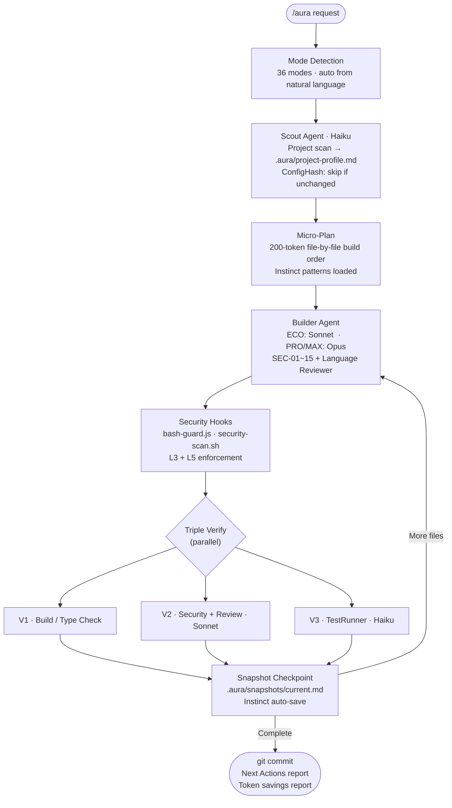

<div align="center">


<br/>

[](https://www.npmjs.com/package/@smorky85/aurakit)
[](https://claude.ai/code)
[](LICENSE)
[](https://github.com/smorky850612/Aurakit/stargazers)
[](https://www.npmjs.com/package/@smorky85/aurakit)
[](https://www.npmjs.com/package/@smorky85/aurakit)
[](package.json)

<br/>

<h3>36 Modes &nbsp;·&nbsp; 30 Hooks &nbsp;·&nbsp; 6-Layer Security &nbsp;·&nbsp; 8 Languages &nbsp;·&nbsp; ~55% Token Savings</h3>

<p>
<a href="#-before--after">Before & After</a>&nbsp;&nbsp;·&nbsp;&nbsp;
<a href="#-quick-start">Quick Start</a>&nbsp;&nbsp;·&nbsp;&nbsp;
<a href="#-36-modes">36 Modes</a>&nbsp;&nbsp;·&nbsp;&nbsp;
<a href="#-quality-tiers">Tiers</a>&nbsp;&nbsp;·&nbsp;&nbsp;
<a href="#%EF%B8%8F-how-it-works">Pipeline</a>&nbsp;&nbsp;·&nbsp;&nbsp;
<a href="#-6-layer-security">Security</a>&nbsp;&nbsp;·&nbsp;&nbsp;
<a href="#-new-in-v64">New in v6.4</a>&nbsp;&nbsp;·&nbsp;&nbsp;
<a href="#-why-aurakit">Why AuraKit</a>&nbsp;&nbsp;·&nbsp;&nbsp;
<a href="#-faq">FAQ</a>
</p>

</div>

---

## What is AuraKit?

**One command. Full-stack app. Production-ready.**

AuraKit is a [Claude Code](https://claude.ai/code) skill that replaces 20+ manual instructions with a single `/aura` command. It auto-detects what you need, scans your project, generates code with security checks on every file, and commits — all in one shot.

```bash
npx @smorky85/aurakit        # Install once (~30 seconds, auto-installs jq)
/aura build: login with JWT  # That's it. AuraKit handles the rest.
```

> [!TIP]
> **30-second install** → `npx @smorky85/aurakit` or `bash install.sh` (v2.0), then type `/aura` in any project. jq, Python, and git are auto-detected and installed if missing.

---

## 🔄 Before & After

<table>
<tr>
<th width="50%">❌ Without AuraKit</th>
<th width="50%">✅ With AuraKit</th>
</tr>
<tr>
<td>

```
You: "Build a login API"
Claude: *generates code*
You: "Wait, add input validation"
Claude: *regenerates*
You: "You forgot error handling"
Claude: *patches*
You: "Check for SQL injection"
Claude: *patches again*
You: "Now write tests"
Claude: *generates tests*
You: "The types are wrong..."
(30 min later, still going)
```

</td>
<td>

```bash
/aura build: login with JWT

# AuraKit automatically:
# → Scans your project stack (Scout/Haiku)
# → Plans file-by-file build order
# → Generates with SEC-01~15 rules
# → Validates types + security + tests
# → Commits: feat(auth): add login
# Done. One command. ~3 minutes.
```

</td>
</tr>
</table>

---

## ⚡ Quick Start

**1 — Install** (choose one)

```bash
# macOS (Homebrew)
brew install smorky85/tap/aurakit

# All platforms (npm)
npx @smorky85/aurakit

# One-liner (macOS / Linux)
curl -fsSL https://raw.githubusercontent.com/smorky850612/Aurakit/main/install.sh | bash

# Windows
npx @smorky85/aurakit

# From source
bash install.sh
```

> [!NOTE]
> All install methods auto-activate L3~L5 security hooks. **install.sh v2.0** auto-detects and installs: `jq` (winget/scoop/choco/brew/apt/dnf/yum/apk/pacman), checks Node.js, Python, and git. Configures settings.json via Python-first (jq fallback). Installs the AuraKit Nexus status bar.

**2 — Use**

```bash
# Recommended for daily use (hooks enforce security without per-action dialogs)
claude --dangerously-skip-permissions

/aura build: login with JWT        # BUILD mode (English)
/aura 로그인 기능 만들어줘         # BUILD mode (Korean · auto-detect)
/aura fix: TypeError in auth.ts    # FIX mode
/aura 코드 정리해줘                # CLEAN mode
/aura Vercel 배포 설정해줘         # DEPLOY mode
/aura 코드 리뷰해줘               # REVIEW mode
/aura! 버튼 색상 변경              # QUICK mode · ~60% fewer tokens
```

> [!WARNING]
> **What `--dangerously-skip-permissions` means:** Claude won't ask for confirmation on each tool use. This is intentional — AuraKit's hooks (`bash-guard.js`, `security-scan.sh`) replace per-action dialogs with automated enforcement. **Without `install.sh`, security relies only on L1/L2 (agent role isolation + tool blocklist).**
>
> **Safer first-time alternative:** Run `claude` without the flag. Claude will ask for permission on each Write/Edit/Bash call.

> [!IMPORTANT]
> Security rules in `~/.claude/rules/aurakit-security.md` are **always active** — applied to every Claude Code session automatically, even without running `/aura`.

---

## 🧬 DNA — 8 Core Principles

> AuraKit enforces these 8 principles in every mode, every turn, every output. Any response that violates them is not AuraKit.

<div align="center">

| # | Principle | Guarantee | Mechanism |
|:-:|:----------|:----------|:----------|
| **1** | ⚡ **FAST** | Faster than any skill | Session cache · ConfigHash · QUICK mode · Progressive Load |
| **2** | ✨ **FLASHY** | Most informative CLI output | StatusLine · Next Actions · Token Report · Pipeline display |
| **3** | 🔐 **SECURE** | Genuinely top-tier security | 6-layer gates · 30 hooks · SEC-01~15 · bash-guard · security-scan |
| **4** | 💰 **THRIFTY** | Max token savings even on Opus | Tiered Model · Fail-Only output · Progressive Load · Session cache |
| **5** | ♾️ **IMMORTAL** | Survives context loss | 65% compact guard · Snapshots · PostCompact restore · Session resume |
| **6** | 🧠 **EVOLVING** | Gets smarter with every use | Instinct learning · instinct:evolve · Pattern sharing |
| **7** | 🌐 **UNIVERSAL** | Any platform, any language | 8 languages · 36 modes · 5 platforms · Non-dev QUICK mode |
| **8** | 🏆 **TOP-TIER** | Best skill, no comparison | Sum of the above 7 |

</div>

---

## 🏆 Why AuraKit?

> "I can just prompt Claude myself" — Yes, but you'll repeat the same 20 instructions every session.

| | Manual Prompting | CLAUDE.md File | **AuraKit v6.4.0** |
|:---|:---:|:---:|:---:|
| Security enforcement | Hope for the best | Rules, no enforcement | **30 hooks enforce at write-time** |
| Context survival | Lost on compact | Partial | **Snapshot + PostCompact auto-restore** |
| Token efficiency | Wasteful | Manual | **~55% ECO · ~75% MAX (estimated)** |
| Code review | Manual | Manual | **4 agents in parallel** |
| Multi-language | English only | English only | **8 languages · 56+ commands** |
| Learns over time | Starts fresh | Starts fresh | **Instinct engine auto-saves patterns** |
| jq / tools | Manual setup | Manual setup | **Auto-installed on first run** |
| Install time | — | 30 min writing rules | **~30 seconds** |

---

## 🎯 36 Modes

AuraKit detects your intent from natural language. Use a namespace prefix (`build:`, `fix:`) when the mode is ambiguous.

### 5 Core Modes — covers 90% of daily use

| Mode | Invoke | What It Does |
|:-----|:-------|:-------------|
| **BUILD** | `/aura build: ...` or just describe it | Discovery → micro-plan → generate → triple verify → commit |
| **FIX** | `/aura fix: ...` or paste the error | Root-cause analysis → minimal change → verify |
| **REVIEW** | `/aura review:` | 4 parallel agents → VULN-NNN report, A–F grade |
| **CLEAN** | `/aura clean:` | Dead code removal, 250-line splits, deduplication |
| **DEPLOY** | `/aura deploy:` | Framework detect → env setup → deploy config → security recheck |

<details>
<summary><strong>📋 31 Extended Modes</strong> — Quality · Planning · Platform · Utility · Auto</summary>

<br/>

**Quality & Testing**

| Mode | Trigger | What It Does |
|:-----|:--------|:-------------|
| **GAP** | `gap:`, match rate | Design ↔ implementation gap analysis (Match Rate %) |
| **ITERATE** | `iterate:`, auto-fix | Auto-improve until Match Rate ≥ 90% (max 5 cycles) |
| **TDD** | `tdd:`, test-first | 🔴 RED → 🟢 GREEN → 🔵 REFACTOR · coverage ≥ 70–90% |
| **QA** | `qa:`, docker logs | Zero-Script QA via real Docker log analysis |
| **QA:E2E** | `qa:e2e:setup` | Playwright E2E — auth / CRUD / responsive / CI pipeline |
| **DEBUG** | `debug:`, 5-why | 4-phase systematic debugging with root-cause tracing |

**Planning & Design**

| Mode | Trigger | What It Does |
|:-----|:--------|:-------------|
| **PM** | `pm:`, PRD, discovery | OST + JTBD + Lean Canvas + PRD · 5 PM agents in parallel |
| **PLAN** | `plan:`, 계획 | Structured plan → `.aura/docs/plan-*.md` |
| **DESIGN** | `design:`, DB 설계 | DB + API + UI workers parallel → cross-consistency check |
| **REPORT** | `report:`, 완료 보고서 | 4-perspective value report (user/biz/tech/ops) |
| **PIPELINE** | `pipeline:`, 개발 순서 | 9-phase guide: Starter / Dynamic / Enterprise |
| **BRAINSTORM** | `brainstorm:`, HMW | HMW + priority matrix → actionable ideas |

**Advanced Operations**

| Mode | Trigger | What It Does |
|:-----|:--------|:-------------|
| **ORCHESTRATE** | `orchestrate:`, leader | Leader / Swarm / Council / Watchdog multi-agent patterns |
| **BATCH** | `batch:[A,B,C]` | Up to 5 features in parallel Git Worktrees |
| **LOOP** | `batch:loop:` `until:pass` | Autonomous iteration loop until condition met |
| **FINISH** | `finish:`, squash | Branch squash merge + Worktree cleanup |
| **ARCHIVE** | `archive:`, archive:list | Archive features without deleting |

**Platform Specialists**

| Mode | Trigger | What It Does |
|:-----|:--------|:-------------|
| **MOBILE** | `mobile:`, react native | React Native / Expo specialized pipeline |
| **DESKTOP** | `desktop:`, electron | Electron / Tauri specialized pipeline |
| **BAAS** | `baas:`, supabase | Supabase / Firebase / bkend integration guide |

**Intelligence & Configuration**

| Mode | Trigger | What It Does |
|:-----|:--------|:-------------|
| **INSTINCT** | `instinct:show` | View / manage / evolve learned project patterns |
| **LANG** | `lang:python`, `lang:go` | Force language-specific code reviewer (10 languages) |
| **MCP** | `mcp:setup`, `mcp:list` | Install & configure 14 MCP server types |
| **CONTENT** | `content:`, 블로그 | Blog, market research, IR deck, tech docs, email, social |
| **STATUS** | `status`, 현재 상태 | Current work state from `.aura/snapshots/` |
| **STATUS:HEALTH** | `status:health` | Health Dashboard — Match Rate · security score · coverage · Tech Debt |
| **CONFIG** | `config:set` | Manage `.aura/config.json` settings |

**Utility**

| Mode | Trigger | What It Does |
|:-----|:--------|:-------------|
| **STYLE** | `style:`, learning | Switch output persona: learning / expert / concise |
| **SNIPPETS** | `snippets:`, 스니펫 | Save and reuse prompt templates |
| **QUICK (`!`)** | `/aura! request` | Protocol-minimal, single file, ~60% token savings |
| **BUILD_RESOLVER** | *(auto on V1 fail)* | Language-specific build error resolver (7 languages) |

</details>

---

## 📊 Quality Tiers

| Tier | Invoke | Scout | Builder | Reviewer | TestRunner | Savings (est.) |
|:-----|:-------|:------|:--------|:---------|:-----------|:---------------|
| **QUICK** | `/aura! request` | — | Sonnet | — | — | ~60% |
| **ECO** *(default)* | `/aura request` | Haiku | Sonnet | Sonnet | Haiku | ~55% |
| **PRO** | `/aura pro request` | Haiku | **Opus** | Sonnet | Haiku | ~20% |
| **MAX** | `/aura max request` | Sonnet | **Opus** | **Opus** | Sonnet | ~0% |

- **QUICK** — Color changes, text edits, single-file tweaks
- **ECO** — Feature development, most daily work *(recommended)*
- **PRO** — Auth, payments, complex business logic
- **MAX** — Security audits, architecture design, production-critical features

> [!NOTE]
> All token savings figures are **estimates** based on tier routing and context load reduction. Context load reduction (v5.1 82KB → v6 20KB) is **measured**. Independent benchmarks (like Aider's Polyglot 64%) do not exist for AuraKit.

---

## ⚙️ How It Works



---

## 🔐 6-Layer Security

Every generated file passes through up to 6 security gates.

<div align="center">

| Layer | Name | What It Checks | Active Without install.sh? |
|:-----:|:-----|:---------------|:--------------------------:|
| **L1** | Agent Roles | Per-agent read/write boundaries in system prompts | ✅ Always |
| **L2** | Disallowed Tools | Write/Edit/Bash blocklist for read-only agents | ✅ Always |
| **L3** | Bash Guard | `rm -rf`, `DROP TABLE`, `eval`, dangerous shell commands | ❌ Requires install.sh |
| **L4** | Worktree Isolation | Agent subprocesses run in isolated Git Worktrees | ❌ Requires install.sh |
| **L5** | Security Scan | API keys, hardcoded secrets, SQL injection, XSS, JWT in localStorage | ❌ Requires install.sh |
| **L6** | Dependency Audit | `npm audit --audit-level=high` on BUILD and FIX | ✅ Auto in pipeline |

</div>

> [!WARNING]
> **L3, L4, L5 are only active after running `install.sh` or `npx @smorky85/aurakit`.** Without installation, only L1 (agent role boundaries) and L2 (tool blocklist) protect you. If you skip installation, omit `--dangerously-skip-permissions` so manual confirmation acts as your safety net.

**Automatically blocked by SEC-01~15:**

```
localStorage.setItem('token', ...)    → httpOnly Cookie required  (SEC-02)
Raw SQL string concatenation          → parameterized queries      (SEC-01)
eval() / exec() with user input       → blocked                    (SEC-05)
Hardcoded API keys / passwords        → blocked                    (SEC-03)
.env not in .gitignore                → commit blocked             (SEC-10)
Math.random() for security tokens     → crypto.randomBytes()       (SEC-08)
HTTP fallback in external calls       → HTTPS only                 (SEC-09)
```

<details>
<summary><strong>🔒 Full SEC-01~15 OWASP Reference</strong></summary>

<br/>

```
SEC-01  SQL injection prevention      SEC-09  HTTPS-only external calls
SEC-02  Auth tokens (httpOnly Cookie) SEC-10  .gitignore enforcement
SEC-03  Secret management             SEC-11  NoSQL/Command/XML/LDAP injection
SEC-04  Input validation (Zod/Pydantic/@Valid) SEC-12  Cryptography (AES-256+)
SEC-05  eval/exec blocking            SEC-13  Dependency audit
SEC-06  Error info leakage prevention SEC-14  Security event logging
SEC-07  CORS whitelist enforcement    SEC-15  SSRF prevention
SEC-08  Secure random (crypto module)
```

All 15 rules are enforced both inline (code generation) and at runtime (security-scan.sh hook on every Write/Edit).

</details>

---

## ✨ New in v6.4

<details>
<summary><strong>🚀 install.sh v2.0 — Zero-friction setup</strong></summary>

<br/>

v6.3 completely rewrites the installer with intelligent dependency management:

| Feature | v6.2 | v6.3 |
|:--------|:-----|:-----|
| jq installation | Warn and exit if missing | **Auto-install** (winget/scoop/choco/brew/apt/dnf/yum/apk/pacman) |
| Settings update | jq required | **Python-first** (jq fallback — works without jq) |
| OS detection | None | `uname -s` → Darwin / Linux / Windows (MINGW/MSYS/CYGWIN) |
| Node.js check | None | **Hard check** — exits with install link if missing |
| Python check | None | **Soft check** — warns if missing (statusline gracefully degrades) |
| git check | None | **Soft check** — warns if missing |
| Language filter | All languages | `--lang=ko,en,jp,zh,es,fr,de,it` selective install |
| Status bar | Not installed | **AuraKit Nexus** auto-installed |

```bash
bash install.sh                    # Full install (all languages)
bash install.sh --lang=en,ko       # English + Korean only
```

</details>

<details>
<summary><strong>📊 AuraKit Nexus Status Bar</strong> — Real-time token & session info</summary>

<br/>

install.sh v2.0 installs the AuraKit Nexus status bar automatically:

```
💰 ECO | ctx: 23% | ↑12.4K ↓8.1K = 20.5K (7회) | 주간: 143K | /aura review
```

- **Subscription users** → daily/weekly remaining % (일↓88% 주↓92%)
- **API users** → actual cost display ($0.23)
- **Auto-resizes**: 3-line (≥80 cols) · 2-line · 1-line (<55 cols)
- **Language auto-detect**: 한국어/日本語/中文/English/...

</details>

<details>
<summary><strong>🪝 30 Hook Files, 16 Events — Complete lifecycle automation</strong></summary>

<br/>

v6.4 includes 30 hook handlers covering the full agent lifecycle:

| Hook Event | Handler File | Function |
|:-----------|:-------------|:---------|
| `SessionStart` | `pre-session.sh` | `.env` security · package manager detect · snapshot check |
| `UserPromptSubmit` | `korean-command.js` | IME reverse-transliteration routing |
| `UserPromptSubmit` | `token-stats-inject.js` | Inject token stats into context |
| `PreToolUse · Bash` | `bash-guard.js` | Dangerous command blocking **(L3)** |
| `PreToolUse · Write/Edit` | `security-scan.sh` | Secret pattern detection **(L5)** |
| `PreToolUse · Write/Edit` | `migration-guard.js` | Destructive DB migration guard |
| `PreToolUse · Agent` | `subagent-start.js` | 🆕 Subagent registration + spawn limit check |
| `PostToolUse · Write/Edit` | `build-verify.sh` | Compile / type-check after every file |
| `PostToolUse · Write/Edit` | `bloat-check.sh` | 250-line split warning |
| `PostToolUse · Write/Edit` | `instinct-auto-save.js` | 🆕 Instinct pattern auto-save |
| `PostToolUse · Write/Edit` | `auto-format.js` | Prettier / gofmt / black / rustfmt |
| `PostToolUse · Write/Edit` | `governance-capture.js` | Architecture decision audit trail |
| `PostToolUse · Agent` | `subagent-stop.js` | 🆕 Subagent completion processing |
| `PostToolUse · Agent` | `teammate-idle.js` | 🆕 Agent memory save |
| `PostToolUse · Agent` | `output-filter.js` | Agent output sanitization |
| `PostToolUse · WebFetch` | `injection-guard.js` | Prompt injection detection |
| `PostToolUseFailure` | `post-tool-failure.js` | MCP recovery + failure tracking |
| `Stop` | `session-stop.js` | Session metrics · Instinct hints · incomplete task alert |
| `Stop` | `token-tracker.js` | Token usage tracking |
| `PreCompact` | `pre-compact-snapshot.sh` | Save context state before compaction |
| `PostCompact` | `post-compact-restore.sh` | Restore context after compaction |
| `SubagentStart` | `subagent-start.js` | 🆕 Agent lifecycle event |
| `TeammateIdle` | `teammate-idle.js` | 🆕 Agent idle event handler |

</details>

<details>
<summary><strong>🎯 STATUS:HEALTH — Mode 36 — Project Health Dashboard</strong></summary>

<br/>

```bash
/aura status:health
```

Generates a real-time project health report:

```
╔══════════════════════════════════════════════════╗
║           AuraKit Health Dashboard               ║
╠══════════════════════════════════════════════════╣
║  Match Rate:    █████████░  87%  (target: ≥90%)  ║
║  Security:      ██████████  98%  (SEC-01~15)      ║
║  Test Coverage: ████████░░  78%  (target: ≥80%)  ║
║  Tech Debt:     ████░░░░░░  Low  (12 items)       ║
║  Doc Lifecycle: ██████░░░░  61%  (needs update)   ║
╠══════════════════════════════════════════════════╣
║  Recommended: /aura iterate  →  /aura tdd        ║
╚══════════════════════════════════════════════════╝
```

</details>

---

## ✨ More v6 Features

<details>
<summary><strong>🧠 Sonnet Amplifier</strong> — Opus-level quality from Sonnet</summary>

<br/>

AuraKit v6 makes Sonnet produce Opus-quality code by forcing structured reasoning before every file:

1. **I/O Contract** — Define types, return values, error cases
2. **Existing Code Check** — Verify import/naming/style compatibility
3. **Edge Case Discovery** — Side effects? Concurrency? Input boundaries? External failures?
4. **SEC/Q Rule Selection** — Pick applicable security & quality rules
5. **Then implement** — Only after all 4 steps

This eliminates Sonnet's tendency to rush to code, producing measurably better output.

</details>

<details>
<summary><strong>🧠 Instinct Learning Engine</strong> — AuraKit gets smarter with every session</summary>

<br/>

AuraKit learns your project's patterns after each BUILD/FIX and applies them automatically on the next run.

```bash
/aura instinct:show              # All learned patterns
/aura instinct:show auth         # Filter by category
/aura instinct:prune             # Remove low-score patterns
/aura instinct:evolve            # Auto-improve + integrate anti-patterns
/aura instinct:export            # Backup / share with team
/aura instinct:import team.json  # Import from another project
/aura instinct:reset             # ⚠️ Reset all patterns (irreversible)
```

| Before install.sh | After install.sh |
|:------------------|:-----------------|
| Patterns saved by Claude's judgment after BUILD/FIX | `instinct-auto-save.js` triggers on every Write/Edit — **fully automated** |
| Semi-automated | **Fully automated** |

</details>

<details>
<summary><strong>🌐 Language-Specific Code Reviewers</strong> — 10 languages with framework awareness</summary>

<br/>

AuraKit auto-detects your project language and applies a specialized reviewer in the V2 step.

| Language | Reviewer Focus |
|:---------|:--------------|
| TypeScript | Strict null checks, React/Next.js/NestJS patterns, generic type safety |
| Python | Type hints, async patterns, FastAPI/Django/Flask idioms |
| Go | Goroutine safety, error wrapping, interface design |
| Java | Generics, Spring patterns, checked exception handling |
| Rust | Ownership, lifetimes, unsafe usage review |
| Kotlin | Coroutines, null safety, idiomatic style |
| C++ | Memory safety, RAII, smart pointer usage |
| Swift | ARC, optionals, Combine / async-await patterns |
| PHP | Type coercion risks, PDO usage, injection vectors |
| Perl | Modern::Perl, regex safety |

```bash
/aura lang:python review:        # Force Python reviewer
/aura lang:go fix: goroutine leak
```

</details>

<details>
<summary><strong>🔌 14 MCP Server Configurations</strong></summary>

<br/>

```bash
/aura mcp:setup           # Interactive setup wizard
/aura mcp:list            # Show all 14 available configs
/aura mcp:check           # Verify installed servers
/aura mcp:add playwright  # Add a specific server
```

Supported: Playwright · GitHub · Slack · Linear · Notion · Supabase · PostgreSQL · MongoDB · Redis · Stripe · Vercel · AWS · Sanity · and more.

</details>

<details>
<summary><strong>📍 Next Actions System</strong> — Auto-suggest after every task</summary>

<br/>

After every mode completion, AuraKit shows what to do next and reports real token savings:

```
━━━━━━━━━━━━━━━━━━━━━━━━━━━━━━━━━━━━━━━━━━
📍 Done: BUILD — JWT Login (8 files)
💰 Token Report:
   Baseline (manual est.): ~18,200 tokens
   Actual used:             ~7,800 tokens
   Saved: 57%  (10,400 tokens)
   ├─ Discovery effect:     -3,200 (삽질 방지)
   ├─ Tier model effect:    -4,800 (haiku Scout + sonnet V2)
   ├─ Cache hit:            -1,500 (session cache + ConfigHash)
   └─ Instinct reuse:         -900 (3 patterns applied)
📊 Pipeline: ████████░░░░ 4/7
   PM ✓ → PLAN ✓ → DESIGN ✓ → BUILD ✓ → REVIEW → ITERATE → DEPLOY
🔜 Next: /aura review → /aura deploy
━━━━━━━━━━━━━━━━━━━━━━━━━━━━━━━━━━━━━━━━━━
```

</details>

<details>
<summary><strong>🌐 Cross-Platform (5 Platforms)</strong> — Claude Code, Codex, Cursor, Manus, Windsurf</summary>

<br/>

| Platform | Support | Setup | Model Mapping |
|:---------|:-------:|:------|:-------------|
| **Claude Code** | ✅ Full | Native — no extra setup | haiku / sonnet / opus |
| **OpenAI Codex CLI** | ✅ Full | SKILL.md auto-recognized | haiku→gpt-4o-mini, sonnet→gpt-4o, opus→o3 |
| **Cursor** | ✅ Supported | `.cursorrules`, Agent Mode | Cursor model selector |
| **Manus** | ✅ Supported | System prompt + multi-agent | Manus routing |
| **Windsurf** | ✅ Supported | `.windsurfrules`, Cascade | Windsurf selector |
| **Aider** | ⚠️ Partial | `.aider.conf.yml` | BUILD/FIX only |
| **Gemini CLI** | 🔬 Experimental | System prompt | Unverified |

```bash
npx @smorky85/aurakit                    # Claude Code (default)
npx @smorky85/aurakit --platform=codex   # Codex CLI adapter
npx @smorky85/aurakit --platform=cursor  # Cursor adapter
npx @smorky85/aurakit --platform=manus   # Manus adapter
```

</details>

<details>
<summary><strong>🤖 Dynamic Agent Spawning</strong> — With circuit breaker</summary>

<br/>

Agents can spawn child agents when tasks are too large. Hard limits prevent runaway:

| Limit | Value |
|:------|:------|
| Max depth | 3 (Agent → Child → Grandchild) |
| Max total per session | 12 |
| Max concurrent | 5 |
| Timeout per agent | 5 minutes |
| Circuit breaker | 3 consecutive failures → freeze + user alert |
| Token budget | 30% of remaining context per agent |

Agent results auto-saved to `.aura/agent-memory/[agent].json` via `teammate-idle.js`.

</details>

<details>
<summary><strong>🔄 Loop Operator</strong> — Autonomous iteration until done</summary>

<br/>

```bash
/aura batch:loop:[task] until:pass    max:5    # Repeat until tests pass
/aura batch:loop:[task] until:90%     max:3    # Repeat until gap ≥ 90%
/aura batch:loop:[task] until:no-error max:10  # Repeat until error-free
```

Each iteration runs in isolation. Loop stops when the condition is met or max is reached.

</details>

---

## 💰 Token Optimization

> All savings figures are **estimates**. Context load reduction is **measured** (v5.1: 82KB → v6: 20KB = 75.6% reduction).

| Technique | How | Savings (est.) |
|:----------|:----|:---------------|
| **SKILL.md slim** | Detailed content delegated to resources, 75% context load reduction | Load savings |
| **Tiered Model** | Scout / TestRunner use Haiku by default | ~40% |
| **Fail-Only Output** | Agents return "Pass" or errors only — no verbose logging | ~30% |
| **Progressive Load** | Resource files loaded per-mode only, not all at once | ~10% |
| **Session Cache (B-0)** | Skip project re-scan if within 2 hours | ~10% |
| **ConfigHash** | Rescan only when `package.json` / lockfile changes | ~10% |
| **Graceful Compact** | Triggers at 65% context + checkpoint saves state | waste eliminated |
| **QUICK Mode** | `/aura!` — no protocol, single file | ~60% |

---

## 🌍 Multilingual Commands

8 languages, 56+ commands. Type in your language without switching input methods.

<div align="center">

| Language | Start | Build | Fix | Clean | Deploy | Review |
|:---------|:------|:------|:----|:------|:-------|:-------|
| 🇺🇸 English | `/aura` | `/aura build:` | `/aura fix:` | `/aura clean:` | `/aura deploy:` | `/aura review:` |
| 🇰🇷 Korean | `/아우라` | `/아우라빌드` | `/아우라수정` | `/아우라정리` | `/아우라배포` | `/아우라리뷰` |
| 🇯🇵 Japanese | `/オーラ` | `/オーラビルド` | `/オーラ修正` | `/オーラ整理` | `/オーラデプロイ` | `/オーラレビュー` |
| 🇨🇳 Chinese | `/奥拉` | `/奥拉构建` | `/奥拉修复` | `/奥拉清理` | `/奥拉部署` | `/奥拉审查` |
| 🇪🇸 Spanish | `/aura-es` | `/aura-construir` | `/aura-arreglar` | `/aura-limpiar` | `/aura-desplegar` | `/aura-revisar` |
| 🇫🇷 French | `/aura-fr` | `/aura-construire` | `/aura-corriger` | `/aura-nettoyer` | `/aura-deployer` | `/aura-reviser` |
| 🇩🇪 German | `/aura-de` | `/aura-bauen` | `/aura-beheben` | `/aura-aufraeumen` | `/aura-deployen` | `/aura-pruefen` |
| 🇮🇹 Italian | `/aura-it` | `/aura-costruire` | `/aura-correggere` | `/aura-pulire` | `/aura-distribuire` | `/aura-rivedere` |

</div>

> **v6.3**: All 56+ multilingual commands are handled by the core `/aura` skill via auto-detection. No separate skill folders needed — freeing ~83% of Claude Code's skill description budget.

**IME support**: Korean and Japanese IME reverse-transliteration is handled automatically by `hooks/korean-command.js`.

---

## 🔧 Compatibility

| Tool | SKILL.md | Hooks | Agents | Support |
|:-----|:--------:|:-----:|:------:|:-------:|
| **Claude Code** *(recommended)* | ✅ | ✅ 23 files · 16 events | ✅ 7 agent types | **Full** |
| **OpenAI Codex CLI** | ✅ | ✅ sandbox pre/post | ✅ agents.md | **Full** |
| **Cursor** | ✅ | ⚠️ VS Code Tasks | ✅ Agent Mode | **Supported** |
| **Manus** | ✅ | ✅ event system | ✅ native multi-agent | **Supported** |
| **Windsurf** | ✅ | ⚠️ VS Code Tasks | ✅ Cascade | **Supported** |
| **Aider** | ✅ | ❌ | ❌ | Partial |
| **Gemini CLI** | ✅ | ❌ | ❌ | Experimental |

---

<details>
<summary><strong>📁 Full Repository Structure</strong></summary>

<br/>

```
aurakit/                             # v6.4.0
├── skills/
│   ├── aura/                        # Main skill — single /aura entry point
│   │   ├── SKILL.md                 # Core instructions (~31KB, 36 modes)
│   │   └── resources/               # 30+ mode-specific pipeline guides
│   │       ├── build-pipeline.md
│   │       ├── fix-pipeline.md
│   │       ├── security-rules.md    # SEC-01~15 full reference
│   │       ├── instinct-system.md
│   │       ├── language-reviewers.md  # 10 language reviewers
│   │       ├── loop-pipeline.md
│   │       ├── mcp-configs.md       # 14 MCP server configs
│   │       ├── cross-harness.md     # 5-platform guide
│   │       ├── status-dashboard.md  # Health Dashboard (v6.3)
│   │       └── ...                  # +20 more guides
│   ├── aura-compact/                # Snapshot + /compact shortcut
│   └── aura-guard/                  # Token budget monitor
├── agents/
│   ├── scout.md                     # Read-only project scanner (Haiku)
│   ├── worker.md                    # Reviewer + TestRunner (Sonnet)
│   ├── gap-detector.md              # Design↔implementation gap (Haiku)
│   ├── security.md                  # OWASP Top 10 audit (Sonnet)
│   ├── pm-discovery.md              # OST opportunity mapping (Haiku)
│   ├── pm-strategy.md               # JTBD + Lean Canvas (Haiku)
│   └── pm-prd.md                    # PRD generation (Sonnet)
├── hooks/                           # 30 hook files
│   ├── lib/
│   │   ├── common.js                # Shared: addContext, allow, block
│   │   ├── snapshot.js              # Snapshot read/write helpers
│   │   └── python.js                # Cross-platform Python executor
│   ├── security-scan.sh             # Secret pattern detection (L5) ← .sh
│   ├── bash-guard.js                # Dangerous command blocking (L3)
│   ├── build-verify.sh              # Compile / type-check after each file ← .sh
│   ├── bloat-check.sh               # 250-line split warning ← .sh
│   ├── migration-guard.js           # Destructive migration blocking
│   ├── injection-guard.js           # Prompt injection detection
│   ├── instinct-auto-save.js        # Instinct pattern auto-save (v6.3 new)
│   ├── auto-format.js               # Prettier / gofmt / black / rustfmt
│   ├── governance-capture.js        # Architecture decision audit trail
│   ├── post-tool-failure.js         # MCP recovery + failure tracking
│   ├── session-stop.js              # Session metrics + Instinct hints
│   ├── subagent-start.js            # Agent lifecycle (v6.3 new)
│   ├── subagent-stop.js             # Agent lifecycle (v6.3 new)
│   ├── teammate-idle.js             # Agent memory save (v6.3 new)
│   ├── korean-command.js            # IME reverse-transliteration
│   ├── pre-compact-snapshot.sh      # Save context before compact ← .sh
│   ├── post-compact-restore.sh      # Restore context after compact ← .sh
│   ├── token-tracker.js             # Token usage tracking
│   └── token-stats-inject.js        # Token stats context injection
├── rules/
│   └── aurakit-security.md          # Always-active security rules
├── templates/
│   ├── design-system-default.md     # CSS variable token defaults
│   └── project-profile-template.md
├── statusline/                      # AuraKit Nexus status bar (v6.3 new)
│   ├── statusline-command.sh
│   └── statusline-parser.py
├── tests/                           # AuraScore test suite (v6.3 new)
│   ├── run-tests.sh
│   ├── test-build-basic.md
│   ├── test-scout-detect.md
│   ├── test-instinct-save.md
│   ├── test-quick-mode.md
│   └── test-safety-net.md
├── install.sh                       # Installer v2.0 (auto-jq, Python-first)
├── CHANGELOG.md                     # Version history
├── SECURITY.md                      # Vulnerability reporting policy
├── CONTRIBUTING.md
└── LICENSE                          # MIT
```

</details>

---

## 🤝 Contributing

We welcome contributions! Add language reviewers, framework patterns, hooks, or security rules.

```bash
# Quick contribution workflow
fork → branch (feat/reviewer-csharp) → create files → bash tests/run-tests.sh → PR
```

See [CONTRIBUTING.md](CONTRIBUTING.md) for templates and quality requirements.

| Contribution | Path | Requirements |
|:-------------|:-----|:-------------|
| Language Reviewer | `resources/language-reviewers.md` | 10 rules + 5 checklist items + V1 command |
| Framework Pattern | `resources/framework-patterns.md` | File structure + 10 rules |
| Hook | `hooks/[name].js` or `.sh` | Error handling + install.sh registration |
| Security Rule | `rules/aurakit-security.md` SEC-16+ | OWASP/CWE mapping + no duplicates |
| Mode | `skills/aura/resources/[mode]-pipeline.md` | Full pipeline spec + SKILL.md entry |

---

## ❓ FAQ

<details>
<summary><strong>Click to expand all questions</strong></summary>

<br/>

**What frameworks does AuraKit support?**

Any framework. Scout reads `package.json`, `tsconfig`, `tailwind.config`, `prisma.schema`, `Dockerfile`, `go.mod`, `pyproject.toml`, and more to adapt automatically. Next.js, React, Vue, Svelte, Express, FastAPI, Django, Spring — all work out of the box.

**Does AuraKit work with existing projects?**

Yes. AuraKit scans your existing codebase first (via Scout agent), then generates code that matches your existing conventions, styling, and architecture.

**What happens if I already have hooks configured?**

`install.sh` (v2.0) updates your `settings.json` using Python-first logic that preserves your existing configuration while adding AuraKit hooks.

**Does AuraKit work on Windows?**

Yes, no WSL required. Shell hooks (`.sh`) run via Git Bash; Node hooks (`.js`) run cross-platform. Git Bash is recommended for Claude Code itself.

**How does compact defense work?**

AuraKit sets `CLAUDE_AUTOCOMPACT_PCT_OVERRIDE=65`, triggering compaction at 65% token usage instead of the default 95%. A `PreCompact` hook saves your current work state. A `PostCompact` hook restores it. Zero context loss.

**Is my code sent anywhere?**

No. AuraKit is a local skill. Everything runs inside your Claude Code session. No external APIs, no telemetry, no data collection.

**How is AuraKit different from just prompting Claude?**

Manual prompting requires re-explaining your project, conventions, and requirements every session. AuraKit pre-loads all of that automatically via Scout, enforces security through hooks, uses specialized agents for each role, and learns your patterns over time — without extra effort after initial install.

**The token savings numbers seem high. Are they real?**

Context load reduction (v5.1 82KB → v6 20KB) is **measured**. Per-task savings (~55% ECO, ~75% MAX) are **estimates** based on tier routing and prompt engineering — no independent benchmark like Aider's Polyglot 64% exists for AuraKit.

**Do I need all 30 hooks? Can I use only some?**

Yes. Install registers all hooks, but each is independent. Remove any entry from `settings.json` to disable it. The security hooks (L3/L5) are most critical; the rest are quality-of-life.

</details>

---

<div align="center">

<br/>

### Try it now — it takes ~30 seconds:

```bash
npx @smorky85/aurakit
```

Then open any project and type `/aura`.

<br/>

**AuraKit v6.4.0 — 36 modes · 30 hooks · 6-layer security · 5 platforms · ~55% token savings**

<br/>

[](https://github.com/smorky850612/Aurakit/stargazers)

<br/>

If AuraKit saves you time, [give it a star ⭐](https://github.com/smorky850612/Aurakit/stargazers) — it helps others find it.

<br/>

<a href="https://github.com/smorky850612/Aurakit">GitHub</a>&nbsp;&nbsp;·&nbsp;&nbsp;<a href="https://www.npmjs.com/package/@smorky85/aurakit">npm</a>&nbsp;&nbsp;·&nbsp;&nbsp;<a href="https://github.com/smorky850612/Aurakit/issues">Issues</a>&nbsp;&nbsp;·&nbsp;&nbsp;<a href="CONTRIBUTING.md">Contribute</a>&nbsp;&nbsp;·&nbsp;&nbsp;<a href="CHANGELOG.md">Changelog</a>&nbsp;&nbsp;·&nbsp;&nbsp;<a href="LICENSE">MIT License</a>

<br/>

</div>
