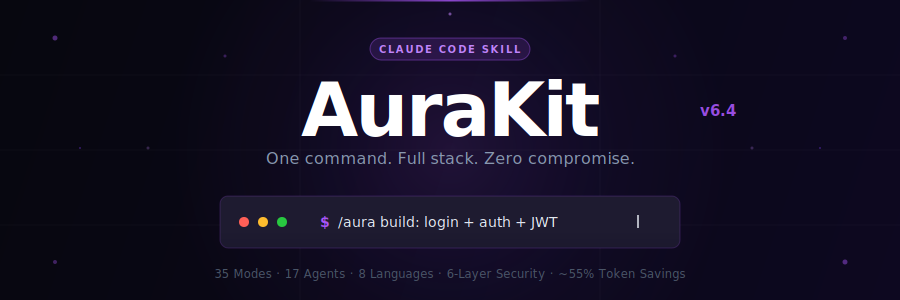
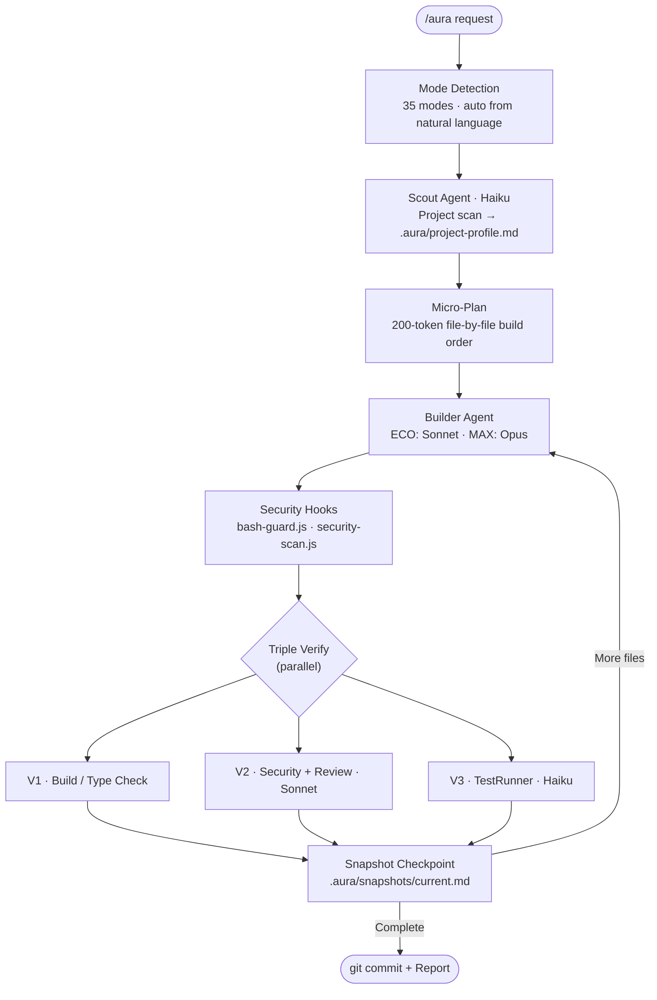

<div align="center">



<br/>

[](https://github.com/smorky850612/Aurakit/releases)
[](https://claude.ai/code)
[](LICENSE)
[](https://github.com/smorky850612/Aurakit/stargazers)
[](install.sh)
[](https://www.npmjs.com/package/@smorky85/aurakit)

<br/>

<p>
<a href="#-before--after">Before & After</a>&nbsp;&nbsp;·&nbsp;&nbsp;
<a href="#-quick-start">Quick Start</a>&nbsp;&nbsp;·&nbsp;&nbsp;
<a href="#-34-intelligent-modes">34 Modes</a>&nbsp;&nbsp;·&nbsp;&nbsp;
<a href="#-quality-tiers">Tiers</a>&nbsp;&nbsp;·&nbsp;&nbsp;
<a href="#-how-it-works">Pipeline</a>&nbsp;&nbsp;·&nbsp;&nbsp;
<a href="#-6-layer-security">Security</a>&nbsp;&nbsp;·&nbsp;&nbsp;
<a href="#-new-in-v6">New in v6</a>&nbsp;&nbsp;·&nbsp;&nbsp;
<a href="#-why-aurakit">Why AuraKit</a>&nbsp;&nbsp;·&nbsp;&nbsp;
<a href="#-faq">FAQ</a>
</p>

</div>

---

## What is AuraKit?

**One command. Full-stack app. Production-ready.**

AuraKit is a [Claude Code](https://claude.ai/code) skill that replaces 20+ manual instructions with a single `/aura` command. It auto-detects what you need, scans your project, generates code with security checks on every file, and commits — all in one shot.

```bash
npx @smorky85/aurakit        # Install once (30 seconds)
/aura build: login with JWT   # That's it. AuraKit handles the rest.
```

<!-- DEMO: Replace this comment with your recorded GIF

-->

> [!TIP]
> **30-second install** → `npx @smorky85/aurakit` or `bash install.sh`, then type `/aura` in any project.

---

## 🔄 Before & After

<table>
<tr>
<th width="50%">Without AuraKit</th>
<th width="50%">With AuraKit</th>
</tr>
<tr>
<td>

```
You: "Build a login API"
Claude: *generates code*
You: "Wait, add input validation"
Claude: *regenerates*
You: "You forgot error handling"
Claude: *patches*
You: "Check for SQL injection"
Claude: *patches again*
You: "Now write tests"
Claude: *generates tests*
You: "The types are wrong..."
(30 min later, still going)
```

</td>
<td>

```bash
/aura build: login with JWT

# AuraKit automatically:
# → Scans your project stack
# → Plans file-by-file build order
# → Generates with SEC-01~15 rules
# → Validates types + security + tests
# → Commits: feat(auth): add login
# Done. One command. ~3 minutes.
```

</td>
</tr>
</table>

---

## ⚡ Quick Start

**1 — Clone**

```bash
git clone https://github.com/smorky850612/Aurakit.git
cd Aurakit
```

**2 — Install** (choose one)

```bash
bash install.sh                    # Full install (recommended)
# or
npx @smorky85/aurakit              # One-click npm install
```

Copies skills, hooks (13 handlers), and agents into your Claude Code environment. Merges hooks into `settings.json` without overwriting your existing configuration.

**3 — Use**

```bash
claude --dangerously-skip-permissions

/aura 로그인 기능 만들어줘         # Korean · auto-detect BUILD
/aura build: login with JWT        # English · namespace prefix
/aura fix: TypeError in auth.ts    # FIX mode
/aura! 버튼 색상 변경               # QUICK mode · ~60% fewer tokens
```

> [!NOTE]
> AuraKit is **framework-agnostic** — Next.js, FastAPI, Spring, Go, Rust, or anything else. Scout auto-detects your stack.

---

## 🏆 Why AuraKit?

> "I can just prompt Claude myself" — Yes, but you'll repeat the same 20 instructions every session.

| | Manual Prompting | CLAUDE.md File | **AuraKit** |
|:---|:---:|:---:|:---:|
| Security enforcement | Hope for the best | Rules, no enforcement | **13 hooks enforce at write-time** |
| Context survival | Lost on compact | Partial | **Snapshot + auto-restore** |
| Token efficiency | Wasteful | Manual | **75% reduction (verified)** |
| Code review | Manual | Manual | **4 agents in parallel** |
| Multi-language support | English only | English only | **8 languages, 56+ commands** |
| Learning over time | Starts fresh | Starts fresh | **Instinct engine remembers** |
| Install time | — | 30 min writing rules | **30 seconds** |

---

## 🎯 34 Intelligent Modes

AuraKit detects your intent from natural language. Use a namespace prefix (`build:`, `fix:`) when the mode is ambiguous.

| Category | Mode | Trigger | What It Does |
|:---------|:-----|:--------|:-------------|
| **Core** | BUILD | 만들어, create, implement | Discovery → micro-plan → generate → triple verify → commit |
| | FIX | 에러, bug, TypeError, crash | Root-cause analysis → minimal change → verify |
| | CLEAN | 정리, refactor, 重构 | Dead code removal, 250-line splits, deduplication |
| | DEPLOY | 배포, vercel, docker | Framework detect → env setup → deploy config → security recheck |
| | REVIEW | 리뷰, audit, check | 4 parallel agents → VULN-NNN report, A–F grade |
| **Quality** | GAP | gap, match rate | Design ↔ implementation gap (Match Rate %) |
| | ITERATE | 반복, auto-fix | Auto-improve until Match Rate ≥ 90% (max 5 cycles) |
| | TDD | tdd, test-first | 🔴 RED → 🟢 GREEN → 🔵 REFACTOR · coverage ≥ 70–90% |
| | QA | qa, docker logs | Zero-Script QA via real Docker log analysis |
| | DEBUG | 디버그, 5-why | 4-phase systematic debugging with root-cause tracing |
| **Planning** | PM | 기획, PRD, discovery | OST + JTBD + Lean Canvas + PRD · 5 PM agents in parallel |
| | PLAN | 계획, plan | Structured plan → `.aura/docs/plan-*.md` |
| | DESIGN | DB 설계, API spec | DB + API + UI workers parallel → cross-consistency check |
| | REPORT | 완료 보고서, report | 4-perspective value report (user/biz/tech/ops) |
| | PIPELINE | 개발 순서 | 9-phase guide: Starter / Dynamic / Enterprise |
| | BRAINSTORM | 아이디어, HMW | HMW + priority matrix → actionable ideas |
| **Advanced** | ORCHESTRATE | leader, swarm, council | Leader / Swarm / Council / Watchdog multi-agent patterns |
| | BATCH | 병렬 처리 | Up to 5 features in parallel Git Worktrees |
| | LOOP | until:pass, until:90% | Autonomous iteration loop until condition met |
| | FINISH | squash, merge | Branch squash merge + Worktree cleanup |
| **Platform** | MOBILE | react native, expo | React Native / Expo specialized pipeline |
| | DESKTOP | electron, tauri | Electron / Tauri specialized pipeline |
| | BAAS | supabase, firebase, bkend | BaaS platform integration guide |
| **v5.1 New** | INSTINCT | instinct:show | View / manage learned project patterns |
| | LANG | lang:python, lang:go | Force language-specific code reviewer (10 languages) |
| | MCP | mcp:setup, mcp:list | Install & configure 14 MCP server types |
| | CONTENT | 블로그, IR덱, SNS | Blog, market research, IR deck, tech docs, email, social |
| **Utility** | STYLE | learning, expert, concise | Switch output persona |
| | SNIPPETS | 스니펫, snippet | Save and reuse prompt templates |
| | STATUS | status, 현재 상태 | Current work state from `.aura/snapshots/` |
| | CONFIG | config:set | Manage `.aura/config.json` settings |
| | ARCHIVE | archive:list | Archive features without deleting |
| | QUICK (`!`) | `/aura! request` | Protocol-minimal, single file, ~60% token savings |
| **Auto** | QA:E2E | qa:e2e:setup, qa:e2e:ci | Playwright E2E — auth / CRUD / responsive / CI pipeline |
| | BUILD_RESOLVER | *(auto on V1 fail)* | Language-specific build error resolver (7 languages) |

---

## 📊 Quality Tiers

| Tier | Invoke | Scout | Builder | Reviewer | TestRunner | Savings |
|:-----|:-------|:------|:--------|:---------|:-----------|:--------|
| **QUICK** | `/aura! request` | — | Sonnet | — | — | ~60% |
| **ECO** *(default)* | `/aura request` | Haiku | Sonnet | Sonnet | Haiku | ~55% |
| **PRO** | `/aura pro request` | Haiku | **Opus** | Sonnet | Haiku | ~20% |
| **MAX** | `/aura max request` | Sonnet | **Opus** | **Opus** | Sonnet | baseline |

- **QUICK** — Color changes, text edits, single-file tweaks
- **ECO** — Feature development, most daily work *(recommended)*
- **PRO** — Auth, payments, complex business logic
- **MAX** — Security audits, architecture design, production-critical features

---

## ⚙️ How It Works



---

## 🔐 6-Layer Security

Every generated file passes through 6 automated security gates.

| Layer | What It Checks | Trigger |
|:------|:---------------|:--------|
| **L1 — Agent Roles** | Per-agent read/write boundaries in system prompts | Always |
| **L2 — Disallowed Tools** | Write/Edit/Bash blocklist for read-only agents | Always |
| **L3 — Bash Guard** | Dangerous commands: `rm -rf`, `DROP TABLE`, `eval` | PreToolUse (Bash) |
| **L4 — Security Scan** | API keys, hardcoded secrets, SQL injection, XSS patterns | PreToolUse (Write/Edit) |
| **L5 — Migration Guard** | Destructive DB migrations require explicit confirmation | PreToolUse (Write) |
| **L6 — Dependency Audit** | `npm audit --audit-level=high` on BUILD and FIX | Auto in pipeline |

> [!IMPORTANT]
> Security rules in `~/.claude/rules/aurakit-security.md` are **always active** — applied to every Claude Code session automatically, even without running `/aura`.

**Automatically blocked:**

```
localStorage.setItem('token', ...)    → httpOnly Cookie required
Raw SQL string concatenation          → parameterized queries required
eval() / exec() with user input       → blocked
Hardcoded API keys / passwords        → blocked
.env not in .gitignore                → commit blocked
```

---

## ✨ New in v6

<details>
<summary><strong>Sonnet Amplifier</strong> — Opus-level quality from Sonnet</summary>

<br/>

AuraKit v6 makes Sonnet produce Opus-quality code by forcing structured reasoning before every file:

1. **I/O Contract** — Define types, return values, error cases
2. **Existing Code Check** — Verify import/naming/style compatibility
3. **Edge Case Discovery** — Side effects? Concurrency? Input boundaries? External failures? State dependencies?
4. **SEC/Q Rule Selection** — Pick applicable security & quality rules
5. **Then implement** — Only after all 4 steps

This eliminates Sonnet's tendency to rush to code, producing measurably better output.

</details>

<details>
<summary><strong>75% Token Reduction</strong> — Verified, not estimated</summary>

<br/>

v6 loads only what's needed: 1 language reviewer (not all 10), 1 framework pattern (not all 5), keywords instead of code examples. Measured: v5.1 BUILD loaded 82KB → v6 loads 20KB.

| What Changed | v5.1 | v6 |
|:-------------|:-----|:---|
| SKILL.md | 20KB (408 lines) | 14KB (318 lines) |
| BUILD total load | 82KB | 20KB |
| Security rules | 6 (duplicated) | SEC-01~15 (OWASP complete) |
| Hooks registered | 12 | 13 (bash-guard added) |

</details>

<details>
<summary><strong>SEC-01~15 OWASP-Complete Security</strong> — 15 inline rules + 13 runtime hooks</summary>

<br/>

```
SEC-01  SQL injection          SEC-09  HTTPS only
SEC-02  Auth (httpOnly)        SEC-10  .gitignore enforcement
SEC-03  Secret management      SEC-11  NoSQL/Command/XML/LDAP injection
SEC-04  Input validation       SEC-12  Cryptography (AES-256+)
SEC-05  eval/exec blocking     SEC-13  Dependency audit
SEC-06  Error info leakage     SEC-14  Security logging
SEC-07  CORS whitelist         SEC-15  SSRF prevention
SEC-08  Secure random
```

Plus 13 runtime hooks enforce these at write-time — zero tokens, zero escape.

</details>

<details>
<summary><strong>🧠 Instinct Learning Engine</strong> — AuraKit gets smarter with every session</summary>

<br/>

AuraKit learns your project's patterns after each BUILD/FIX and applies them automatically on the next run.

```bash
/aura instinct:show              # All learned patterns
/aura instinct:show auth         # Filter by category
/aura instinct:prune             # Remove low-score patterns
/aura instinct:evolve            # Auto-improve + integrate anti-patterns
/aura instinct:export            # Backup / share with team
/aura instinct:import team.json  # Import from another project
```

Patterns are stored in `.aura/instincts/` and auto-loaded at the start of every `/aura` session. Teams can share patterns via `instinct:export` / `instinct:import`.

</details>

<details>
<summary><strong>🌐 Language-Specific Code Reviewers</strong> — 10 languages with framework awareness</summary>

<br/>

AuraKit auto-detects your project language and applies a specialized reviewer in the V2 step.

| Language | Reviewer Focus |
|:---------|:--------------|
| TypeScript | Strict null checks, React/Next.js/NestJS patterns, generic type safety |
| Python | Type hints, async patterns, FastAPI/Django/Flask idioms |
| Go | Goroutine safety, error wrapping, interface design |
| Java | Generics, Spring patterns, checked exception handling |
| Rust | Ownership, lifetimes, unsafe usage review |
| Kotlin | Coroutines, null safety, idiomatic style |
| C++ | Memory safety, RAII, smart pointer usage |
| Swift | ARC, optionals, Combine / async-await patterns |
| PHP | Type coercion risks, PDO usage, injection vectors |
| Perl | Modern::Perl, regex safety |

Force a specific reviewer:

```bash
/aura lang:python review:
/aura lang:go fix: goroutine leak
```

</details>

<details>
<summary><strong>🔌 14 MCP Server Configurations</strong> — One-command setup</summary>

<br/>

```bash
/aura mcp:setup           # Interactive setup wizard
/aura mcp:list            # Show all 14 available configs
/aura mcp:check           # Verify installed servers
/aura mcp:add playwright  # Add a specific server
```

Supported: Playwright · GitHub · Slack · Linear · Notion · Supabase · PostgreSQL · MongoDB · Redis · Stripe · Vercel · AWS · Sanity · and more.

</details>

<details>
<summary><strong>🔄 Loop Operator</strong> — Autonomous iteration until done</summary>

<br/>

```bash
/aura batch:loop:[task] until:pass    max:5   # Repeat until tests pass
/aura batch:loop:[task] until:90%     max:3   # Repeat until gap ≥ 90%
/aura batch:loop:[task] until:no-error max:10 # Repeat until error-free
```

Each iteration runs in isolation. Loop stops when the condition is met or max iterations is reached.

</details>

<details>
<summary><strong>🪝 13 Hook Events</strong> — Full automation lifecycle</summary>

<br/>

| Hook Event | Handler | What It Does |
|:-----------|:--------|:-------------|
| `SessionStart` | `pre-session.js` | `.env` security · package manager detect · snapshot check |
| `UserPromptSubmit` | `korean-command.js` | IME reverse-transliteration routing |
| `PreToolUse · Bash` | `bash-guard.js` | Dangerous command blocking (L3) |
| `PreToolUse · Write/Edit` | `security-scan.js` | Secret pattern detection (L4) |
| `PreToolUse · Write/Edit` | `migration-guard.js` | Destructive migration blocking (L5) |
| `PostToolUse · Write/Edit` | `build-verify.js` | Compile / type-check after every file |
| `PostToolUse · Write/Edit` | `bloat-check.js` | 250-line split warning |
| `PostToolUse · Write/Edit` | `auto-format.js` | Prettier / gofmt / black / rustfmt |
| `PostToolUse · Write/Edit` | `governance-capture.js` | Architecture decision audit trail |
| `PostToolUseFailure` | `post-tool-failure.js` | MCP recovery + failure tracking |
| `Stop` | `session-stop.js` | Session metrics · Instinct hints · incomplete task alert |
| `PreCompact` / `PostCompact` | snapshot hooks | Context save / restore around compaction |

</details>

---

## 💰 Token Optimization

**v6 BUILD: ~6,700 tokens vs ~27,000 in v5.1 — 75% reduction (verified)**

| Technique | How | Savings |
|:----------|:----|:--------|
| Tiered Model | Scout / TestRunner use Haiku by default | ~40% |
| Fail-Only Output | Agents return "Pass" or errors only — no verbose logging | ~30% |
| Progressive Load | Resource files loaded per-mode only, not all at once | ~10% |
| Session Cache (B-0) | Skip project re-scan if within 2 hours | ~10% |
| ConfigHash | Rescan only when `package.json` / lockfile changes | ~10% |
| Graceful Compact | Triggers at 65% context (vs default 95%) + checkpoint saves | waste eliminated |
| QUICK Mode | `/aura!` — no protocol, single file | ~60% |

---

## 🌍 Multilingual Commands

Type in your language without switching input methods. 8 languages, 56+ commands.

<div align="center">

| Language | Start | Build | Fix | Clean | Deploy | Review | Compact |
|:---------|:------|:------|:----|:------|:-------|:-------|:--------|
| 🇰🇷 Korean | `/아우라` | `/아우라빌드` | `/아우라수정` | `/아우라정리` | `/아우라배포` | `/아우라리뷰` | `/아우라컴팩트` |
| 🇯🇵 Japanese | `/オーラ` | `/オーラビルド` | `/オーラ修正` | `/オーラ整理` | `/オーラデプロイ` | `/オーラレビュー` | `/オーラコンパクト` |
| 🇨🇳 Chinese | `/奥拉` | `/奥拉构建` | `/奥拉修复` | `/奥拉清理` | `/奥拉部署` | `/奥拉审查` | `/奥拉压缩` |
| 🇪🇸 Spanish | `/aura-es` | `/aura-construir` | `/aura-arreglar` | `/aura-limpiar` | `/aura-desplegar` | `/aura-revisar` | `/aura-compactar` |
| 🇫🇷 French | `/aura-fr` | `/aura-construire` | `/aura-corriger` | `/aura-nettoyer` | `/aura-deployer` | `/aura-reviser` | `/aura-compresser` |
| 🇩🇪 German | `/aura-de` | `/aura-bauen` | `/aura-beheben` | `/aura-aufraeumen` | `/aura-deployen` | `/aura-pruefen` | `/aura-komprimieren` |
| 🇮🇹 Italian | `/aura-it` | `/aura-costruire` | `/aura-correggere` | `/aura-pulire` | `/aura-distribuire` | `/aura-rivedere` | `/aura-compattare` |
| 🇺🇸 English | `/aura` | `/aura build:` | `/aura fix:` | `/aura clean:` | `/aura deploy:` | `/aura review:` | `/aura-compact` |

</div>

**IME support**: Korean and Japanese IME reverse-transliteration is handled automatically by `hooks/korean-command.js`.

---

## 🔧 Compatibility

| Tool | SKILL.md | Hooks | Agents | Support Level |
|:-----|:---------|:------|:-------|:--------------|
| **Claude Code** *(recommended)* | ✅ | ✅ | ✅ | **Full** |
| **Cursor** | ✅ | ⚠️ manual | ⚠️ manual | Partial |
| **OpenAI Codex** | ✅ | ❌ | ❌ | Basic |
| **OpenCode** | ✅ | ❌ | ❌ | Basic |
| **Gemini CLI** | ✅ | ❌ | ❌ | Experimental |
| **Windsurf / Roo Code** | ✅ | ❌ | ❌ | Basic |

**Full support** = automated 6-layer security + 17 specialized agents + compact defense + triple verification. With other tools, you get core skill instructions without automated enforcement.

---

<details>
<summary><strong>📁 Full Architecture</strong></summary>

<br/>

```
aurakit/
├── skills/
│   ├── aura/                        # Main skill — single /aura entry point
│   │   ├── SKILL.md                 # Core instructions (AuraKit v5.1)
│   │   └── resources/               # 30+ mode-specific pipeline guides
│   │       ├── build-pipeline.md
│   │       ├── fix-pipeline.md
│   │       ├── security-rules.md
│   │       ├── instinct-system.md
│   │       ├── language-reviewers.md
│   │       ├── loop-pipeline.md
│   │       ├── mcp-configs.md
│   │       └── ...                  # +22 more guides
│   ├── aura-compact/                # Snapshot + /compact shortcut
│   ├── aura-guard/                  # Token budget monitor
│   └── [56 multilingual shortcuts]  # 8 languages × 7 modes
├── agents/
│   ├── scout.md                     # Read-only project scanner (Haiku)
│   ├── worker.md                    # Reviewer + TestRunner (Sonnet)
│   ├── gap-detector.md              # Design↔implementation gap (Haiku)
│   ├── security.md                  # OWASP Top 10 audit (Sonnet)
│   ├── pm-discovery.md              # OST opportunity mapping (Haiku)
│   ├── pm-strategy.md               # JTBD + Lean Canvas (Haiku)
│   └── pm-prd.md                    # PRD generation (Sonnet)
├── hooks/
│   ├── lib/
│   │   ├── common.js                # Shared: addContext, allow, block
│   │   ├── snapshot.js              # Snapshot read/write helpers
│   │   └── python.js                # Cross-platform Python executor
│   ├── security-scan.js             # Secret pattern detection (L4)
│   ├── bash-guard.js                # Dangerous command blocking (L3)
│   ├── build-verify.js              # Compile / type-check after each file
│   ├── bloat-check.js               # 250-line split warning
│   ├── migration-guard.js           # Destructive migration blocking (L5)
│   ├── injection-guard.js           # Prompt injection detection
│   ├── auto-format.js               # Prettier / gofmt / black / rustfmt
│   ├── governance-capture.js        # Architecture decision audit trail
│   ├── post-tool-failure.js         # MCP recovery + failure tracking
│   ├── session-stop.js              # Session metrics + Instinct hints
│   ├── korean-command.js            # IME reverse-transliteration
│   ├── pre-compact-snapshot.js      # Save context before compact
│   ├── post-compact-restore.js      # Restore context after compact
│   ├── token-tracker.js             # Token usage tracking
│   └── token-stats-inject.js        # Token stats context injection
├── rules/
│   └── aurakit-security.md          # Always-active security rules
├── templates/
│   ├── design-system-default.md     # CSS variable token defaults
│   └── project-profile-template.md
├── install.sh                       # One-command installer
├── README.md
└── LICENSE                          # MIT
```

</details>

<details>
<summary><strong>🔒 Security Pattern Reference</strong></summary>

<br/>

`security-scan.js` checks for these patterns on every file write:

```
API Keys:         [A-Za-z0-9]{32,} in key/secret/token context
AWS Keys:         AKIA[0-9A-Z]{16}
Private Keys:     -----BEGIN.*PRIVATE KEY-----
Passwords:        password\s*=\s*['"][^'"]+
JWT Hardcoded:    eyJ[A-Za-z0-9]{20,}
Connection Str:   (mongodb|postgres|mysql):\/\/.*:.*@
localStorage:     localStorage\.setItem\(['"]token
SQL Concat:       query\s*\+=|query\s*=.*\+.*req\.(body|params|query)
```

</details>

## 🤝 Contributing

We welcome contributions! Add language reviewers, framework patterns, hooks, or security rules.

```bash
# Quick contribution workflow
fork → branch (feat/reviewer-csharp) → create files → node -c hooks/*.js → PR
```

See [CONTRIBUTING.md](CONTRIBUTING.md) for templates and quality requirements.

| Contribution | Path | Requirements |
|:-------------|:-----|:-------------|
| Language Reviewer | `resources/reviewers/[lang].md` | 10 rules + 5 checklist items + V1 command |
| Framework Pattern | `resources/frameworks/[fw].md` | File structure + 10 rules |
| Hook | `hooks/[name].js` | Shebang + error handling + install.sh registration |
| Security Rule | `SKILL.md SEC-16+` | OWASP/CWE mapping + no duplicates |

---

## ❓ FAQ

<details>
<summary><strong>Click to expand all questions</strong></summary>

<br/>

**What frameworks does AuraKit support?**

Any framework. Scout reads `package.json`, `tsconfig`, `tailwind.config`, `prisma.schema`, `Dockerfile`, `go.mod`, `pyproject.toml`, and more to adapt automatically. Next.js, React, Vue, Svelte, Express, FastAPI, Django, Spring — all work out of the box.

**Does AuraKit work with existing projects?**

Yes. AuraKit scans your existing codebase first, then generates code that matches your existing conventions, styling, and architecture.

**What happens if I already have hooks configured?**

`install.sh` merges AuraKit hooks into your existing `settings.json` without overwriting. Your current hooks stay intact.

**Does AuraKit work on Windows?**

Yes, no WSL required. All hooks run as Node.js scripts (cross-platform). Git Bash is recommended for running Claude Code itself.

**How does compact defense work?**

AuraKit sets `CLAUDE_AUTOCOMPACT_PCT_OVERRIDE=65`, triggering compaction at 65% token usage instead of the default 95%. A `PreCompact` hook saves your current work state to disk. A `PostCompact` hook restores it after. Zero context loss.

**Is my code sent anywhere?**

No. AuraKit is a local skill. Everything runs inside your Claude Code session. No external APIs, no telemetry, no data collection.

**How is AuraKit different from just prompting Claude?**

Manual prompting requires you to re-explain your project, conventions, and requirements every session. AuraKit pre-loads all of that automatically, enforces it through hooks, and uses specialized agents for each role — without you doing anything extra after the initial install.

</details>

---

<div align="center">

<br/>

### Try it now — it takes 30 seconds:

```bash
npx @smorky85/aurakit
```

Then open any project and type `/aura`.

<br/>

**AuraKit v6 — Sonnet Amplified. 34 modes. SEC-01~15. 13 hooks. 75% token reduction.**

[](https://github.com/smorky850612/Aurakit/stargazers)

<br/>

If AuraKit saves you time, [give it a star](https://github.com/smorky850612/Aurakit/stargazers) — it helps others find it.

<br/>

<a href="https://github.com/smorky850612/Aurakit">GitHub</a>&nbsp;&nbsp;·&nbsp;&nbsp;<a href="https://www.npmjs.com/package/@smorky85/aurakit">npm</a>&nbsp;&nbsp;·&nbsp;&nbsp;<a href="https://github.com/smorky850612/Aurakit/issues">Issues</a>&nbsp;&nbsp;·&nbsp;&nbsp;<a href="CONTRIBUTING.md">Contribute</a>&nbsp;&nbsp;·&nbsp;&nbsp;<a href="LICENSE">MIT License</a>

<br/>

</div>
