<div align="center">



<br/>

[]()
[]()

</div>

# Architecture

> How AuraKit works under the hood.

---

## High-Level Flow

```
User: /aura build: payment integration

  ┌────────────────────────────────────────────┐
  │          SKILL.md (Core Engine)            │
  │                                            │
  │  1. Intent Detection  →  MODE: BUILD       │
  │  2. Quality Tier      →  ECO (default)     │
  │  3. Universal Protocols  B-0 → B-5         │
  │  4. Load resource guides (build-pipeline)  │
  └──────────────────┬─────────────────────────┘
                     │
  ┌──────────────────▼─────────────────────────┐
  │          Agent Orchestration               │
  │                                            │
  │  Scout (Haiku)   → project-profile.md      │
  │  Worker (Sonnet) → generates code          │
  │  Worker (Sonnet) → validates + tests       │
  └──────────────────┬─────────────────────────┘
                     │
  ┌──────────────────▼─────────────────────────┐
  │              Hook Layer                    │
  │                                            │
  │  PreToolUse(Bash)   → bash-guard.js  [L3] │
  │  PreToolUse(Write)  → security-scan  [L4] │
  │  PreToolUse(Write)  → migration-guard[L5] │
  │  PostToolUse(Write) → build-verify.js      │
  │  PostToolUse(Write) → auto-format.js       │
  └──────────────────┬─────────────────────────┘
                     │
               git commit -m "..."
```

---

## Universal Protocols (B-0 to B-5)

Every `/aura` command, regardless of mode, runs these in order:

<details open>
<summary><b>Protocol sequence</b></summary>

| Protocol | Name | What it does |
|:--------:|------|--------------|
| **B-0** | Session Cache | Skip rescan if profile exists and is < 2 hours old |
| **B-1** | Project Profile | Scout scans → `project-profile.md` |
| **B-2** | Security Pre-check | Verify L1 + L5 state before any action |
| **B-3** | Design System | Load `.aura/design-system.md` if present |
| **B-4** | Session Resume | Restore from `.aura/snapshots/current.md` if interrupted |
| **B-5** | Instinct Load | Load learned patterns from `.aura/instincts/` |

> [!NOTE]
> B-0 (session cache) is the biggest single token saver. After the first scan, subsequent commands in the same session reuse the profile — no re-scanning the entire codebase.

</details>

---

## Hook System

<details>
<summary><b>PreToolUse hooks — fire before a tool executes</b></summary>

| Hook | Watches | Purpose |
|------|---------|---------|
| `bash-guard.js` | `Bash` | Block `rm -rf`, `DROP TABLE`, `eval`, `curl\|bash` |
| `security-scan.js` | `Write`, `Edit` | Detect secrets, injection, XSS, insecure auth |
| `migration-guard.js` | `Write` | Block destructive DB ops without confirmation |
| `injection-guard.js` | `Bash`, `Write` | Detect prompt injection attempts |
| `korean-command.js` | User input | Reverse-transliterate Korean/Japanese IME commands |

</details>

<details>
<summary><b>PostToolUse hooks — fire after a tool completes</b></summary>

| Hook | Watches | Purpose |
|------|---------|---------|
| `build-verify.js` | `Write`, `Edit` | Compile + type-check every written file |
| `auto-format.js` | `Write`, `Edit` | Run Prettier / gofmt / black / rustfmt |
| `governance-capture.js` | `Write` | Log architecture decisions to `.aura/governance/` |
| `token-tracker.js` | All tools | Track token usage per session |

</details>

<details>
<summary><b>Session lifecycle hooks</b></summary>

| Hook | Event | Purpose |
|------|-------|---------|
| `pre-compact-snapshot.js` | Before `/compact` | Save full session state |
| `post-compact-restore.js` | After `/compact` | Restore context automatically |
| `subagent-start.js` | Agent spawn | Initialize agent with role + permission boundaries |

</details>

---

## .aura/ Directory

AuraKit creates and manages this directory at your project root:

```
.aura/
├── project-profile.md      ← Stack scan output (Scout)
├── design-system.md        ← CSS tokens and design decisions
├── snapshots/
│   └── current.md          ← Latest session checkpoint
├── instincts/
│   ├── patterns.md         ← Patterns that worked → reuse
│   └── anti-patterns.md    ← Mistakes to avoid
├── governance/
│   └── decisions.md        ← Architecture decision log
├── logs/
│   └── session-YYYY-MM-DD.md
└── agent-memory/
    └── worker.md           ← Worker agent learnings
```

> [!TIP]
> Commit `.aura/` to your repository. The instinct patterns and governance log become more valuable over time and should be shared with your team.

---

## Instinct System

<details>
<summary><b>How AuraKit learns from every session</b></summary>

After each successful build or fix, the Instinct engine:

1. Extracts the pattern that worked
2. Stores it in `.aura/instincts/patterns.md`
3. Loads it at B-5 in the next session → Worker uses it proactively

After a security violation or test failure:

1. Extracts the anti-pattern
2. Stores in `.aura/instincts/anti-patterns.md`
3. Worker checks this list before generating any code

Over time, AuraKit gets fewer corrections and makes fewer mistakes in your specific codebase. It learns your team's conventions, preferred libraries, and architectural patterns.

</details>

---

## Sonnet Amplifier

<details>
<summary><b>Why the first attempt is almost always correct</b></summary>

Before writing every file, Worker runs a structured 5-step reasoning protocol:

```
Step 1: I/O Contract
  → Define: inputs, outputs, side effects, error cases

Step 2: Existing Code Check
  → Search for similar code — no duplication

Step 3: Edge Case Enumeration
  → null/undefined, empty collections, integer overflow,
    concurrent access, network failures

Step 4: Security Rule Verification
  → Which of SEC-01 to SEC-15 apply to this code?
  → Apply them before writing a single line

Step 5: Implementation
  → Write the code with all of the above in mind
```

This protocol is what drives the 75% token reduction. Fewer iterations because the first attempt already handles edge cases, security, and existing patterns.

</details>

---

## Token Optimization Techniques

| Technique | Savings |
|-----------|:-------:|
| Tiered models (Haiku for Scout/TestRunner) | ~30% |
| Fail-only output (no verbose success logs) | ~15% |
| Progressive resource loading (mode-specific guides only) | ~15% |
| Session cache (skip rescan within 2 hours) | ~10% |
| ConfigHash (rescan only when package.json changes) | ~5% |
| Graceful compact at 65% context (vs 95% default) | prevents waste |

---

## Multi-Agent Orchestration

<details>
<summary><b>4 coordination patterns</b></summary>

| Pattern | Structure | Best for |
|---------|-----------|----------|
| **Leader** | 1 orchestrator → N workers | Standard feature builds |
| **Swarm** | N parallel → merge results | Independent file changes |
| **Council** | N agents vote → decision | Architecture decisions |
| **Watchdog** | 1 monitor → N workers | Long-running tasks |

```bash
/aura orchestrate: refactor the entire auth module
# → spawns Leader + 3 Workers in parallel
# → each Worker handles a different file group
# → Leader merges and resolves conflicts
```

</details>
